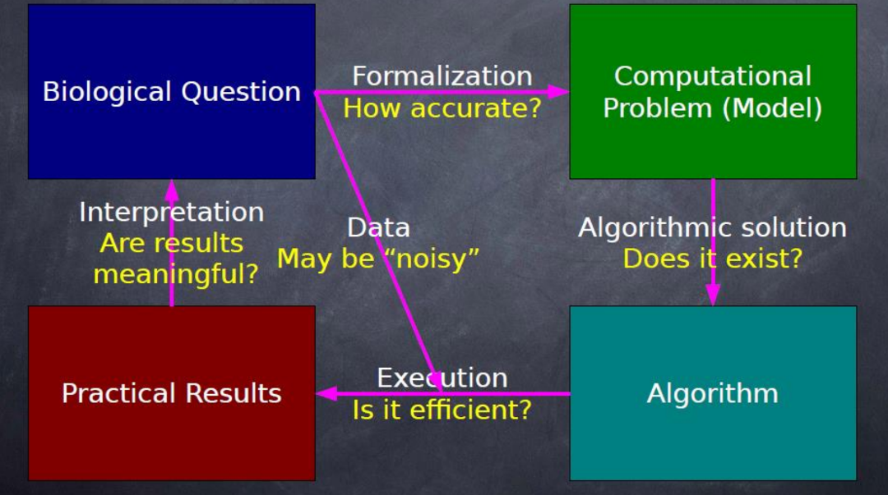
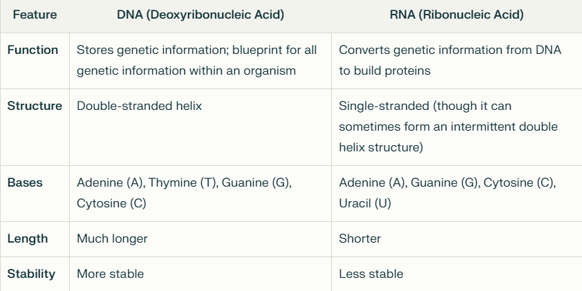
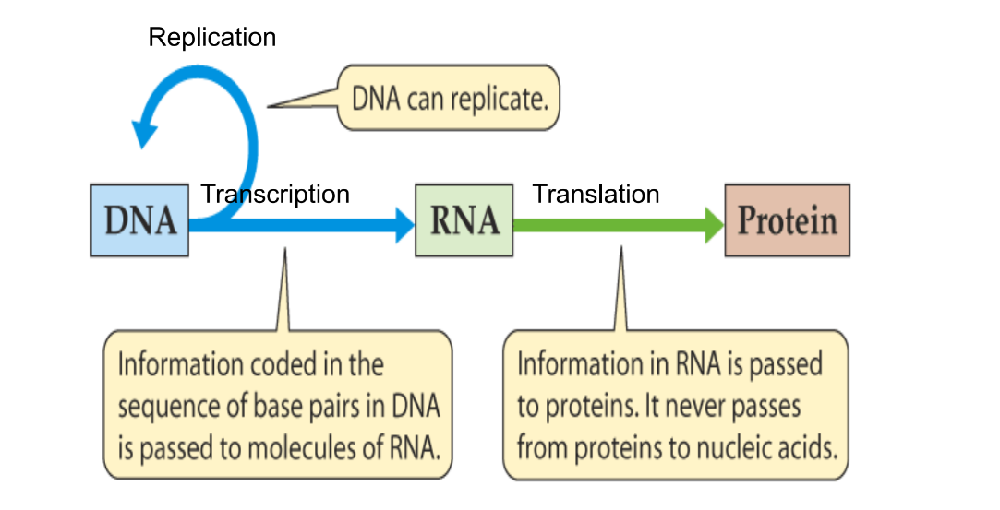
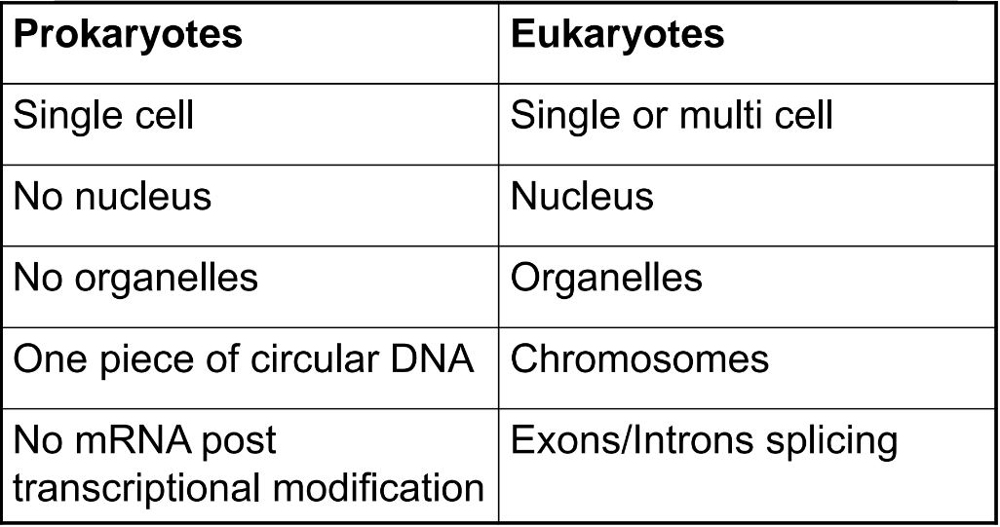

# Bioinformatics

## 1. What is Bioinformatics?

Simply, Bioinformatics is any activity that deals with biological data using computational tools.

## 2. Needs for Bioinformatics

1. Data provide the foundation on which scientific knowledge is constructed.
2. Usual concern voiced by scientists is that they have too few data.
3. Data to be useful, they must be in a form that researchers can work with and make sense of, and this can become harder to do as the amount of data grows.

## 3. Goals of Bioinformatics

1. Understand a living cell and how it functions at molecular level.
2. Develop databases and computational tools.
3. Tools are used to mine (analyze) databases to generate knowledge to better understand the living systems.

## 4. Steps to Achieve the Goals of Bioinformatics

1. The complete understanding of an organism given its genomic data.
2. Organizes data to be easily accessible (GeneBank).
3. Develops tools aid in the analysis of data (BLAST).
4. Interpret the results in a biologically meaningful manner.

## 5. Illustrate the Bioinformatics Workflow

## 6. Mention All the Differences Between DNA and RNA

## 7. Describe Shortly, the Flow of Genetic Information According to the 'Central Dogma of Molecular Biology'

## 8. Compare Between Prokaryotes and Eukaryotes

