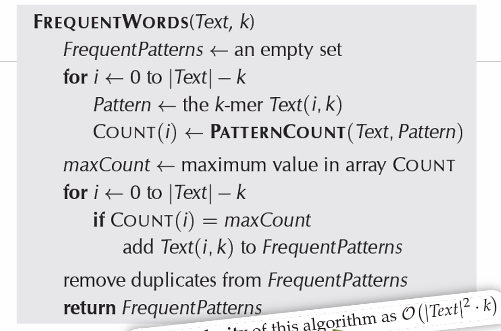

# Lecture Summary: Introduction to Bioinformatics (Lecture #2)

## 1. Summary of Key Concepts

### Genome Replication

- **Replication Origin (OriC):** Region where DNA replication begins.
- **DnaA Protein:** Binds to OriC, unwinds DNA, and initiates replication by recruiting helicase.
- **Reverse Complement:** DNA strands are antiparallel (5'→3' and 3'→5'). The reverse complement of a DNA string is formed by reversing the sequence and complementing each nucleotide (A↔T, C↔G).
  - **Example:** ATG → CAT (reverse complement).

### Hidden Messages in DNA

- **Frequent Words Problem:** Finding the most frequent k-mers (substrings of length _k_) in a DNA sequence.
  - **Example:** In _Vibrio cholerae_ OriC, `ATGATCAAG` and `CTTGATCAT` are frequent 9-mers.
- **DnaA Boxes:** Short DNA sequences (e.g., 9-mers) where DnaA binds to initiate replication.

### Algorithms

- **FrequentWords Algorithm:**
  1. Slide a window of length _k_ across the text.
  2. Count occurrences of each k-mer.
  3. Identify k-mers with maximum frequency.
  - **Time Complexity:** \(O((n-k)^2 \cdot k)\), where \(n =\) length of Text.
    

### Key Definitions

- **COUNT(Text, Pattern):** Number of times a k-mer Pattern appears in Text, including overlapping occurrences.
- **Reverse Complement Problem:** Compute the reverse complement of a DNA string.

## 2. Multiple-Choice Questions (MCQs)

### Genome Replication

1. What initiates DNA replication in bacteria?

   - a) Helicase
   - b) DnaA
   - c) RNA polymerase
   - d) DNA ligase

2. Where does replication begin in a bacterial genome?
   - a) Telomere
   - b) OriC
   - c) Centromere
   - d) Promoter

### Reverse Complements

3. What is the reverse complement of ATGC?

   - a) TACG
   - b) GCAT
   - c) CGTA
   - d) CATG

4. Why are DNA strands antiparallel?
   - a) To allow hydrogen bonding
   - b) To ensure complementary base pairing
   - c) To prevent mutations
   - d) To speed up replication

### Frequent Words Problem

5. What is the output of the FrequentWords algorithm?

   - a) All k-mers in the text
   - b) All most frequent k-mers
   - c) The longest k-mer
   - d) The rarest k-mer

### Algorithms

6. What is the time complexity of the FrequentWords algorithm?

   - a) \(O(n)\)
   - b) \(O(n \cdot k)\)
   - c) \(O((n-k)^2 \cdot k)\)
   - d) \(O(n \log n)\)

7. How does the algorithm COUNT(Text, Pattern) handle overlapping occurrences?
   - a) Ignores them
   - b) Counts all overlapping matches
   - c) Only counts exact matches
   - d) Skips the first match

### DnaA Boxes

8. DnaA binds to:

   - a) RNA primers
   - b) DnaA boxes
   - c) Telomeres
   - d) Histones

9. Why are frequent k-mers significant in OriC?
   - a) They encode proteins
   - b) They serve as binding sites for replication proteins
   - c) They prevent mutations
   - d) They stabilize DNA structure

## Answer Key

1. **b**
2. **b**
3. **b**
4. **b**
5. **b**
6. **c**
7. **b**
8. **b**
9. **b**
